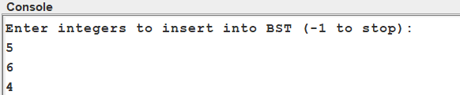
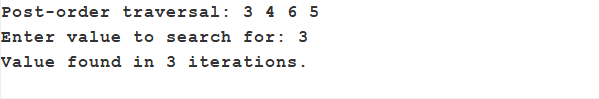

# Unit 4 Assignment — Binary Search Tree Traversals and Search (Java, Jeliot)

## 📜 Assignment Description

This project is part of the Unit 4 assignment for the course, where the goal is to:

- Build a **Binary Search Tree (BST)** in Java using integers entered by the user.
- Perform tree **traversals** (in-order, pre-order, post-order).
- Search the BST for a user-specified value and **report the number of iterations** it took to find the value.
- Use the **Jeliot animation environment** to visualize the algorithm.
- Submit the algorithm code, a written description of the algorithm, an asymptotic (Big O) analysis of the search, and a screenshot of the output.

---

## 🛠 How the Algorithm Works

1. **Input Phase**
   - The program repeatedly prompts the user to enter integers.
   - The user signals the end of input by entering `-1`.
   - All integers (except `-1`) are inserted into the BST.

2. **Building the BST**
   - Each integer is inserted following the binary search tree rule:
     - Values less than the current node go to the left subtree.
     - Values greater than or equal to the current node go to the right subtree.

3. **Tree Traversals**
   - **In-order traversal:** Left → Root → Right
   - **Pre-order traversal:** Root → Left → Right
   - **Post-order traversal:** Left → Right → Root
   - All traversal results are printed to the console.

4. **Search Phase**
   - The program prompts the user to enter a **search value**.
   - It performs an **iterative search** on the BST.
   - It reports:
     - Whether the value was found.
     - How many iterations (steps) were required to find it.

5. **Output**
   - The console shows the traversal results and the search result, including the iteration count.

---

## ⚙️ Asymptotic Analysis (Binary Search on BST)

The **search** method works by repeatedly moving left or right through the tree:

- **Best Case (Big Ω):** O(1)  
  → If the target value is at the root.

- **Average Case:** O(log n)  
  → For a balanced BST, each comparison eliminates half the remaining nodes.

- **Worst Case (Big O):** O(n)  
  → For a completely unbalanced (degenerate) tree (like a linked list), we may have to traverse all nodes.

Therefore, the **worst-case time complexity of the search algorithm is:**

O(n) 

and the **average-case time complexity (for balanced trees) is:**

O(log n)

where `n` is the number of nodes in the tree.

---

## 💻 Code

The Java source code is included in this repository:  
[`BSTTraversalSearch.java`](BSTTraversalSearch.java)

---

## 📸 Screenshot

---

## 📂 How to Run (Jeliot Instructions)

1. Open **Jeliot 3**.
2. Load `BSTTraversalSearch.java`.
3. Run the program.
4. Input integers one at a time. Type `-1` when finished.
5. Observe the traversal outputs.
6. Input a search value.
7. Take a screenshot of the final console output.
8. Add the screenshot to the `screenshots/` folder in this repository.

---

## ✅ Algorithm Requirements Checklist

- ✅ Correct output based on input.
- ✅ Concrete, clear steps.
- ✅ No ambiguity in algorithm flow.
- ✅ Finite number of steps.
- ✅ Terminates after completion.

---

## 📝 License

For academic use only as part of Unit 4 assignment @Uopeople.
